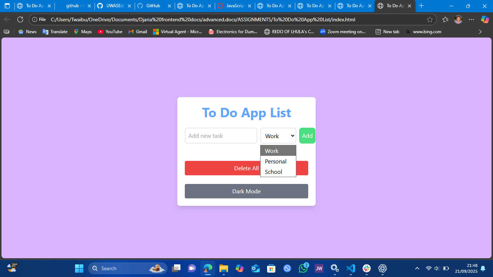
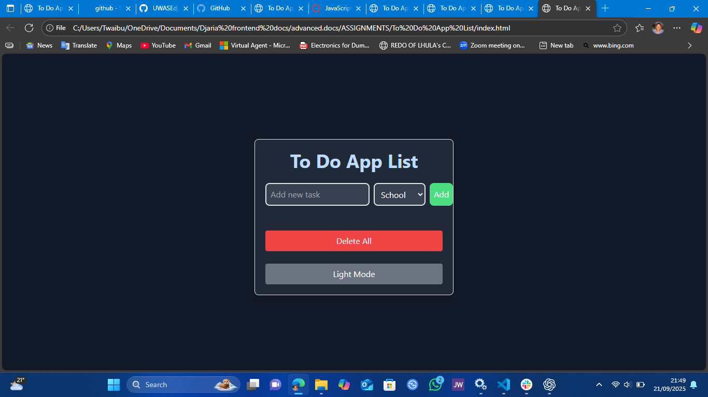

# To Do App List

A modern, responsive To Do List application built with HTML5, Tailwind CSS, and JavaScript. Tasks are persistent using localStorage, and the app supports both light and dark mode.

## Features
- Add, complete, and delete tasks
- Inline task editing
- Persistent tasks with localStorage
- Light/Dark mode toggle
- Responsive and accessible design

## Setup Instructions

1. **Clone the repository:**
   ```sh
   git clone https://github.com/UWASEdjaria/To-Do-List-App.git
   ```
2. **Navigate to the project folder:**
   ```sh
   cd "To-Do-List-App/To Do App List"
   ```
3. **Open `index.html` in your browser:**
   - You can double-click the file or use a local server (e.g., Live Server extension in VS Code).

## Usage Guide

- **Add a Task:**
  - Type your task in the input field and press `Enter` or click the `Add` button.
- **Mark Complete/Incomplete:**
  - Click on a task to toggle its completion (strikethrough effect).
- **Delete a Task:**
  - Click the `Delete` button next to a task to remove it.
- **Delete All Tasks:**
  - Click the `Delete All` button to clear the entire list.
- **Toggle Light/Dark Mode:**
  - Click the `Dark Mode`/`Light Mode` button to switch themes. Your preference is saved.

## Screenshots

> _Add screenshots of the main UI in both light and dark mode here._
> Example:
>
> 
> 

## Technologies Used
- HTML5
- Tailwind CSS
- JavaScript (ES6)
- LocalStorage

## Folder Structure
```
/to-do-list-app
│── /To Do App List
│   ├── index.html
│   ├── index.js
│   └── README.md
```

---

**Project by [UWASEdjaria](https://github.com/UWASEdjaria)**
